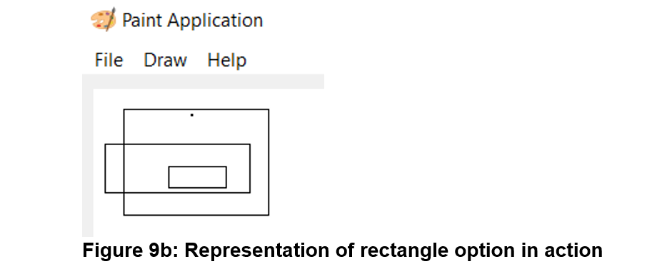

# Painting-Application-PyQt5

Paint Application
UI Design Document

Overall: The default total dimensions of my paint application is 400, 400, 800 and 600 in top, left, width and height respectively. The size of my paint application is resizable. Which means if we need more space for drawing then we can resize the window as needed.

Style and location: I have divided it into 4 parts. They are title bar, menu bar, toolbar and drawing zone (canvas). The title bar contains title “Paint Application” and title image and it is place on the top left corner of the application. The menu bar is place below the title bar which consist File, Draw and Help option. After menu bar whole section is divided into two sections. Left section contains drawing zone whereas, right section contains toolbar which contains QSlider, QRadioButton and color sector.

I also used various set of icons to portray the functionality of file menu option. The menu options are open, save, clear, exit, about and help.

For the color combination, I choose white for the drawing zone and default color (gray) for the toolbox.

			

Brush: After creating overall UI which includes drawing zone, it is absolutely imperative to have a brush to draw in our paint application. For that in my application, I have created brush which function with the mouse events like mousePressEvent(), mouseMoveEvent() and mouseReleaseEvent(). 

All features:

File menu:

Functionality:
The main function of this is to save the drawing, open pervious drawing project, clear the canvas and terminate the program. There are overall 4 option and they are:
	1) Save: This option will save the drawing which is drawn in our paint application. This functionality is not fully working.
	Not Working: Saving a drawing with Point (draw (from menu bar(see figure  1))  point) is working fine. However, if we try to save drawing with shapes like rectangle and ellipse it will not be saved. (We can select shapes by going draw in menu bar.)
	2)Open: open saved paint project from user local directory. After opening we can on the top of it as well.
	3) Clear: Clears the drawing area.
	4) Exit: Terminated our paint application program.

Size: The size is default because it looks natural and blends to overall looks.

Style: The styling is default here.

Help menu:

Functionality: The help menu bar is fully working. When it is clicked, two option is furthered appeared which are:
	1) About: It displays the information about our paint application. The shortcut to access this option is by pressing Control and I at the same time in the keyboard.
	2) Help: It displays the information about how to operate our paint application. The shortcut to access this option is by pressing Control and H at the same time in the keyboard.

Location: The Help menu is placed below the title bar on the top left corner of the application window after file and draw option.

Size: The size is default, same like file menu.

Style: The styling of this menu bar is also default. 

Brush Color ( showColorPrompt() ) : 

Functionality: The brush color widget is perfectly working in our application. The main functionality of the brush color is draw in canvas with several colors. This functionality is possible by using QColorDiaglog which make possible to choose any selection of color as per users need.

Location: The Color widget is situated at the bottom right corner of our paint application inside Toolbar according to figure 1.

Size: The size of the is set to maximum height of 100.

Style: For the styling department, whenever user chooses color from QColorDialog the preview of the color will be shown in color widget in our paint application (see figure 4a).

Brush Thickness ( setBrushSlider() ) : 

 

Functionality: The main function of this widget is to increase and decrease the size of brush thickness with the help of QSlider. 

Location: The Brush thickness widget is situated at the top right corner of our paint application inside Toolbar according to figure 1. 

Size: The size of the brush varies from minimum of 1 to the maximum of 40. The overall size of the widget is set to maximum height of 100.

Style: The style for the brush thickness is default because it gives minimalist look like I wanted it to be.

Brush line type ( setBrushStyle() )

  

Functionality: The main function of this widget the brush line style. Here, we have three variation of brush line type to choose from via QRadioButton. They are: 
										1) Solid 
										2) Dash 
										3) Dot

	
 

Location: The Brush line type widget is situated at the right corner of our paint application just below the brush thickness widget inside Toolbar according to figure 1. 

Size: The overall size of the widget is set to maximum height of 100.

Style: For the styling I have added image in each radio button which represents brush line type.

Brush cap type( setBrushCap() ):

          

Functionality: The main function of this widget is change brush cap type. Here, we have three types of brush cap type to choose from via QRadioButton. And they are: Square, Flat and Round.

Location: The Brush cap type widget is situated at the right corner of our paint application between brush style and brush cap widget inside Toolbar according to figure 1.

Size: The size of the widget is set to maximum height of 100.

Style: The style for the brush cap type is default radio button and text.

Brush join type( setBrushJoin() ):

       

Functionality: The main function of this widget is change brush join type in our paint application with the user of QRadioButton. The types of join which is used are: Round, Miter and Bevel.

Location: The Brush cap type widget is situated at the right corner of our paint application just above color widget inside Toolbar according to figure 1.

Size: The size of the widget is set to maximum height of 100.

Style: The style for the brush join type is default radio button and text.

Additional functionality:
The best ability of this paint application is obviously the functionality to draw in the paint application. However, to notch things up I have added two more option to called Rectangle and Ellipse which will help to add rectangle and ellipse shape in our paint application drawing area (canvas). 

Draw menu:

       

Functionality: The draw menu bar is fully working. When it is clicked, three options are appeared which are:

	1) Point: It is used to draw line in our paint application drawing area.
 
       	

	2) Rectangle: It is used to create any type of rectangle in our paint application.

 		 
	
	3) Ellipse: It is used to create any form of ellipse in our paint application.

		 

Location: The draw menu is placed below the title bar on the top left corner of the application window after file option.

Size: The size is default to make whole menu bar look same and free of visual complexity.

Style: The styling of this draw bar is also default. 

